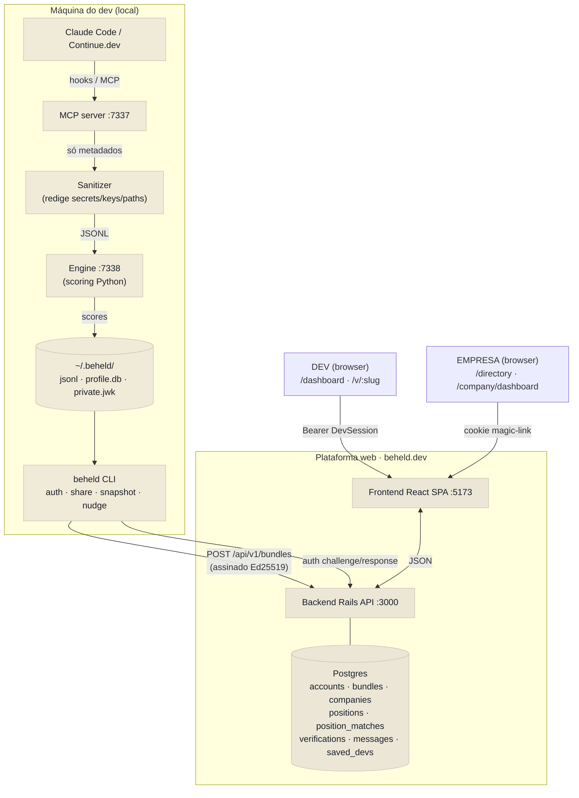
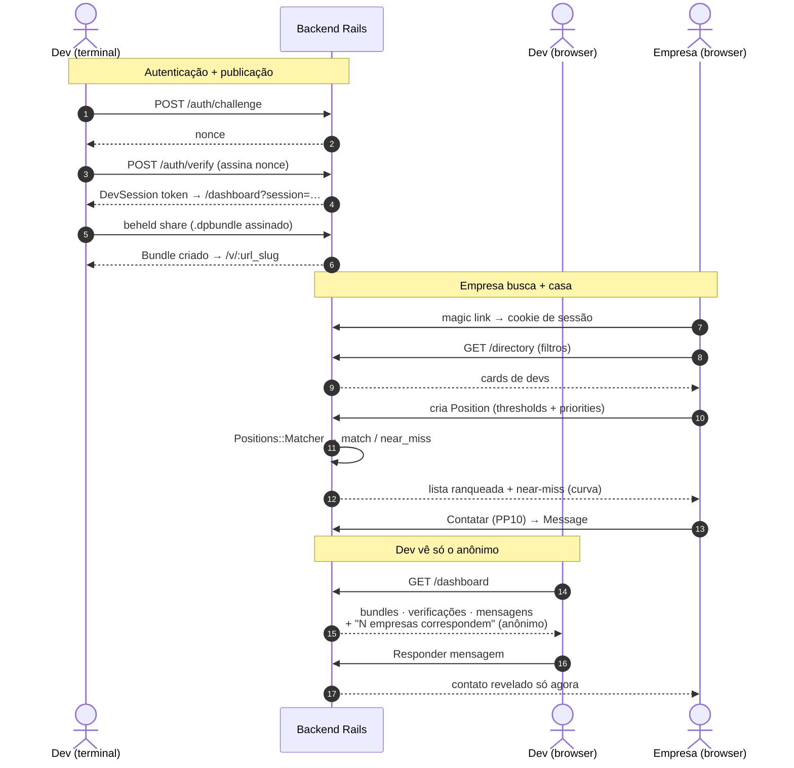

# beheld — Diagrama de Interação

> CLI / Claude (captura local) ⇄ Plataforma web (dev + empresa)
> Atualizado: 2026-05-28

---

## 1. Visão geral (atores + fronteiras)

```
        ┌──────────────────────────── MÁQUINA DO DEV (local) ────────────────────────────┐
        │                                                                                 │
        │   Claude Code / Continue.dev                                                    │
        │        │  hooks (PreToolUse / PostToolUse / Stop) · eventos MCP                 │
        │        ▼                                                                        │
        │   ┌─────────────┐   só metadados    ┌──────────────┐   scores    ┌───────────┐ │
        │   │ MCP server  │ ───────────────▶  │  Sanitizer   │ ─────────▶  │  Engine   │ │
        │   │  :7337      │  (sem conteúdo,   │ (redige seg- │  JSONL      │  :7338    │ │
        │   └─────────────┘   sem secrets)    │  redos/keys) │             │ (Python)  │ │
        │                                     └──────────────┘             └─────┬─────┘ │
        │                                                                        │       │
        │   ~/.beheld/  ◀────────────────────────────────────────────────────────┘       │
        │   sessions/*.jsonl · profile.db · config.json · private.jwk                      │
        │        │                                                                        │
        │        │  beheld CLI (binário standalone)                                       │
        │        ▼                                                                        │
        │   ┌──────────────────────────────────────────────────────────────────────┐    │
        │   │ beheld auth      → challenge/response Ed25519 → DevSession token       │    │
        │   │ beheld share     → assina bundle (.dpbundle) → POST /api/v1/bundles    │    │
        │   │ beheld snapshot  → retrato HTML local (mesmo renderer da web)          │    │
        │   │ (qualquer cmd)   → nudge se bundle ≥ 5 dias (P22)                      │    │
        │   └──────────────────────────────────────────────────────────────────────┘    │
        └────────────────────────────────────────┬────────────────────────────────────────┘
                                                  │  HTTPS (assinado Ed25519)
                                                  ▼
        ┌──────────────────────────── PLATAFORMA WEB · beheld.dev ───────────────────────┐
        │                                                                                 │
        │   Backend Rails API (:3000)            Frontend React SPA (:5173)               │
        │   ┌──────────────────────────┐         ┌──────────────────────────────────┐    │
        │   │ /api/v1/bundles          │         │ /v/:slug  (retrato público)      │    │
        │   │ /api/v1/auth/*           │  JSON   │ /dashboard          (DEV)        │    │
        │   │ /api/v1/dev/*            │ ◀─────▶ │ /directory          (EMPRESA)    │    │
        │   │ /api/v1/company/*        │ cookie/ │ /company/dashboard  (EMPRESA)    │    │
        │   │ /api/v1/sessions/*       │ bearer  │ /accounts/:id/contact (EMPRESA)  │    │
        │   └────────────┬─────────────┘         └──────────────────────────────────┘    │
        │                │                                                                 │
        │      Postgres  ▼                                                                 │
        │   accounts · bundles · companies · positions · position_matches ·               │
        │   verifications · messages · saved_devs · dev_sessions · magic_links            │
        └─────────────────────────────────────────────────────────────────────────────────┘
```

---

## 2. Fluxo do DEV (publicar → ser encontrado passivamente)

```
 DEV (terminal)                     BACKEND                         DEV (browser)
 ───────────────                    ───────                         ─────────────
  beheld auth ───────────▶  POST /auth/challenge  (nonce)
            ◀───────────── assina nonce c/ private.jwk
  beheld auth ───────────▶  POST /auth/verify     ──▶ DevSession token
            ◀───────────── http://localhost:5173/dashboard?session=<token>

  beheld share ──────────▶  POST /api/v1/bundles
   (.dpbundle assinado)        │ verifica assinatura Ed25519
                               │ cria Bundle(url_slug, bundle_data, last_bundle_at)
                               ▼
                          retrato público em /v/:url_slug

                                                    DEV abre /dashboard
                                                     ├─ Visão geral  (curva evolução, interesse anônimo)
                                                     ├─ Publicações  (bundles: verificado/desatualizado/oculto/revogado)
                                                     ├─ Verificações (empresas que abriram o retrato)
                                                     ├─ Mensagens    (responder / ignorar)
                                                     └─ Configurações(contato, visibilidade, notificações)
```

O dev **nunca vê vagas**. Só vê: *"N empresas têm necessidades que correspondem
ao seu perfil esta semana"* (contagem anônima, P21) + nudge de atualização (P22).

---

## 3. Fluxo da EMPRESA (buscar → casar → contatar)

```
 EMPRESA (browser)                          BACKEND
 ─────────────────                          ───────
  signup ─────────────────▶ POST /api/v1/companies
  magic link (email) ─────▶ /sessions/company/verify?token=…  ──▶ cookie _beheld_company_session
                                                                  │
  /directory  ────────────▶ GET /api/v1/directory (filtros JSONB) │
   (test_ratio, ecosystems, status)        ◀── cards de devs ─────┘
        │
        ├─ "Ver perfil →"  → /v/:slug (nova aba)
        ├─ "+ Salvar"      → POST /company/saved_devs  (bookmark privado)
        └─ "Contatar"      → /accounts/:id/contact ─▶ POST contact (Message)  [PP10]

  /company/dashboard ─────▶ GET /api/v1/company/dashboard
   ├─ Visão geral        (stats + taxa de resposta)
   ├─ Atividade recente  (verificações + mensagens)
   ├─ Mensagens          (status: aguardando/respondido/ignorado)
   ├─ Devs salvos        (notas privadas)
   └─ Posições           (matching engine ↓)
```

### Matching (PP16–PP20)

```
  cria Position { thresholds: ecosystems/test_ratio/recency, priorities (drag-to-rank) }
        │
        ▼
  Positions::Matcher  ──▶ varre Account(directory:true) + bundle visível
        │                 BundleSignals (camada tipada: l1.ecosystems, avg_test_ratio, recency)
        │
        ├─ passou todos thresholds        → match     (score ponderado 0–100)
        ├─ falhou 1 threshold (margem 20%) → near_miss (+ curva evolução do test_ratio)
        └─ falhou 2+                        → descartado
        │
        ▼ persiste em position_matches  →  exibido no /company/dashboard#posicoes
  30 dias → expira (lazy) → email "vaga expirada" → revisar/reativar/encerrar
```

---

## 4. Fronteiras de privacidade (invariantes)

```
  ┌─ DEV controla ───────────────┐        ┌─ EMPRESA vê ─────────────────┐
  │ email_contact                │   ✗    │ handle · ecosystems          │
  │ phone_contact   ── NUNCA ────┼──────▶ │ test_ratio · status · slug   │
  │ email_recovery               │ vazam  │ score (matching)             │
  └──────────────────────────────┘        └──────────────────────────────┘
        │                                          │
        │ contato só é revelado QUANDO              │ vê contagem de matches,
        │ o dev clica "Responder" (PP10)           │ nunca o contato cru
        ▼                                          ▼
  ┌─ DEV vê do lado empresa ─────────────────────────────────────────────┐
  │ "N empresas têm necessidades que correspondem ao seu perfil"         │
  │ (contagem anônima · sem nome de empresa · sem score · sem vaga)      │
  └──────────────────────────────────────────────────────────────────────┘

  Outras invariantes:
  · Sanitizer roda em TODO evento antes de qualquer escrita (secrets/keys/paths redigidos)
  · Todas as chamadas ficam em localhost (exceto publish assinado p/ beheld.dev)
  · Job postings são internos — nunca publicados, nunca acessíveis por endpoint do dev
  · SavedDev.note é estritamente privada da empresa que salvou
  · "Forever free para o dev" — zero vocabulário de cobrança
```

---

## 5. Resumo das conexões

| Origem | Destino | Protocolo | Autenticação |
|--------|---------|-----------|--------------|
| Claude Code / Continue | MCP server :7337 | hooks / MCP | local |
| MCP server | Engine :7338 | HTTP local | — |
| CLI `beheld share` | `/api/v1/bundles` | HTTPS | assinatura Ed25519 |
| CLI `beheld auth` | `/api/v1/auth/*` | HTTPS | challenge/response Ed25519 |
| SPA dev | `/api/v1/dev/*` · `/api/v1/dashboard` | HTTPS JSON | Bearer (DevSession) |
| SPA empresa | `/api/v1/company/*` · `/api/v1/directory` | HTTPS JSON | cookie assinado (magic link) |
| SPA `/v/:slug` | `/v/:slug` | HTTPS JSON | público |

---

## 6. Mermaid — arquitetura (flowchart)



## 7. Mermaid — fluxos (sequence)



> Ambos os blocos renderizam direto no GitHub (e em qualquer viewer com
> suporte a Mermaid). Os blocos ASCII das seções 1–4 ficam como fallback
> para terminais / diffs sem renderização.
